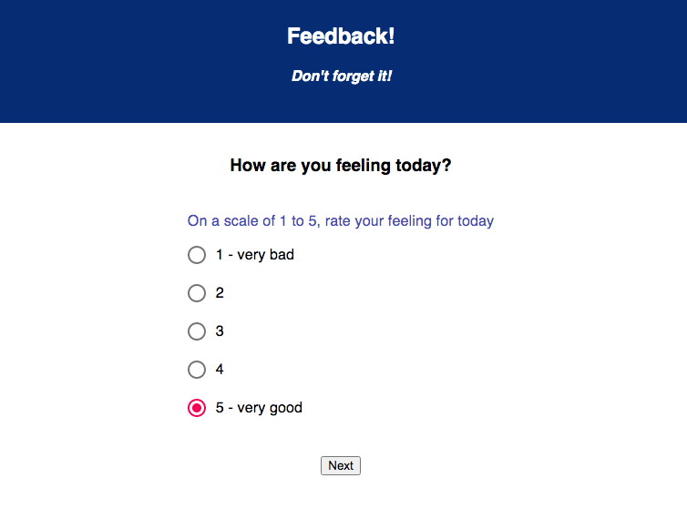
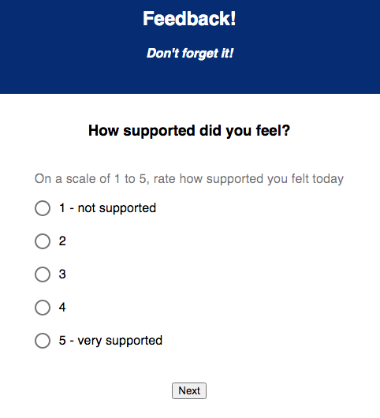
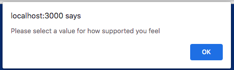
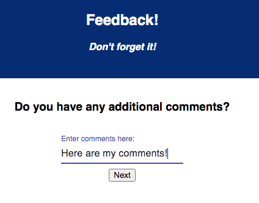
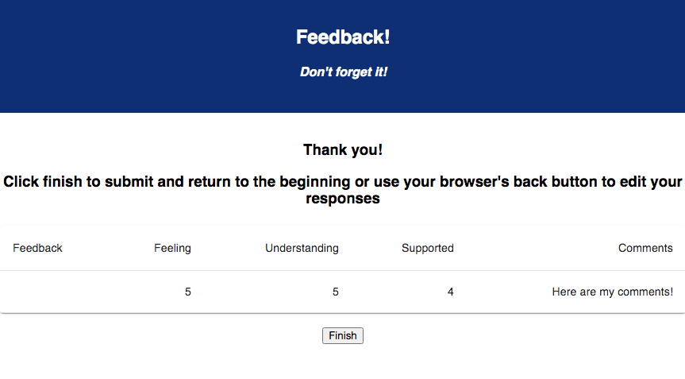

--Description
This project is a user feedback submission form.
Duration: weekend project

--Screen Shots

--Installation

Set-up 'prime_feedback' database using included database.sql file for reference
Run the following commands in separate terminals:
npm install
npm run client
npm run server
--Usage
With the server and client running, open http://localhost:3000/ in a web browser. Enter and submit answers to each of the questions.
Review a summary of your selections.
Click 'Submit' to confirm your selections.
Use the 'Thank You' page to begin a new entry, if desired.
--Technologies Used
React
Redux
Axios
Node
Express
PostgreSQL/Postico
Material-UI

--Acknowledgement
Thanks to my instructors and fellow cohort members at Prime Digital Academy for providing me with the knowledge, support, and encouragement necessary to complete this project!

https://damp-island-43331.herokuapp.com/#/
